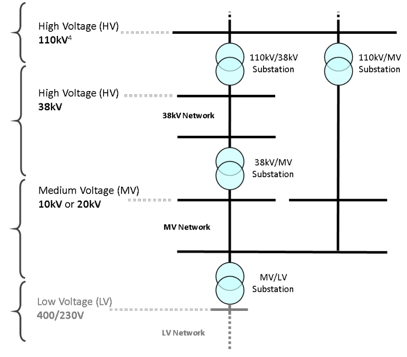

---
jupyter:
  jupytext:
    formats: ipynb,md
    text_representation:
      extension: .md
      format_name: markdown
      format_version: '1.2'
      jupytext_version: 1.9.1
  kernelspec:
    display_name: Python 3
    language: python
    name: python3
---

```python
import numpy as np
import pandas as pd
import geopandas as gpd
import matplotlib.pyplot as plt
import momepy
import networkx as nx
import osmnx as ox
from tqdm import tqdm
```

# Get Small Area boundaries

```bash
# --no-clobber skip downloads that would download to existing files
wget --no-clobber -O data/external/Small_Areas_Ungeneralised_-_OSi_National_Statistical_Boundaries_-_2015-shp.zip https://opendata.arcgis.com/datasets/c85e610da1464178a2cd84a88020c8e2_3.zip
unzip data/external/Small_Areas_Ungeneralised_-_OSi_National_Statistical_Boundaries_-_2015-shp.zip -d data/external/Small_Areas_Ungeneralised_-_OSi_National_Statistical_Boundaries_-_2015-shp
```

```python
small_areas = (
    gpd.read_file("data/external/Small_Areas_Ungeneralised_-_OSi_National_Statistical_Boundaries_-_2015-shp")
    .query("`COUNTYNAME` == ['South Dublin', 'Dún Laoghaire-Rathdown', 'Fingal', 'Dublin City']")
    .loc[:, ["SMALL_AREA", "COUNTYNAME", "geometry"]]
    .to_crs(epsg=2157) # convert to ITM
)
```

# Get Local Authority boundaries

```bash
# --no-clobber skip downloads that would download to existing files
wget --no-clobber -O data/external/dublin_admin_county_boundaries.zip https://zenodo.org/record/4446778/files/dublin_admin_county_boundaries.zip
unzip -d data/external data/external/dublin_admin_county_boundaries.zip 
```

```python
dublin_admin_county_boundaries = (
    gpd.read_file("data/external/dublin_admin_county_boundaries")
    .to_crs(epsg=2157) # read & convert to ITM or epsg=2157
)
```

# Get Network data


Must be downloaded from the Codema Google Shared Drive or <span style="color:red">**requested from the ESB**</span>

```python
network_data = "/home/wsl-rowanm/Data/dublin-electricity-network/"
```

## Get MV Network

```python
mv_network = (
    gpd.read_parquet(f"{network_data}/dublin_lvmv_network.parquet")
    .query("`voltage_kv` == 'mv'")
    .copy()
)
```

```python
mv_network_lines = (
    mv_network.query("`Level` == [10, 11, 14]")
    .explode()
    .reset_index()
    .drop(columns="level_1")
    .loc[:, ["geometry"]]
    .copy()
)
```

```python
base = dublin_admin_county_boundaries.boundary.plot(edgecolor='red', figsize=(25,25))
mv_network_lines.plot(ax=base, markersize=0.1)
```

## Get 38kV, 110kV & 220kV  stations

... there is no 400kV station in Dublin

```python
hv_network = (
    gpd.read_parquet(f"{network_data}/dublin_hv_network.parquet")
    .to_crs(epsg=2157)
)
```

```python
hv_stations = (
    hv_network.query("`Level` == [20, 30, 40]")
    .copy()
    .explode() # un-dissolve station locations from multipoint to single points
    .reset_index()
    .drop(columns="level_1")
)
```

# Extract stations by voltage level




**Source:** ESB "Distribution System Security and Planning Standards", 2020

**Note:** The 110kV system is primarily a transmission system voltage and connections at this voltage level are normally dealt with by Eirgrid (as TSO),
however certain exceptions exist including:
- The 110kV networks within Dublin city and surrounding area are deemed to be DSO operated networks. 
- Tail-fed 110kV substations and connecting circuits used to connect lower voltage demand customers are deemed to be DSO operated
installations and it is possible that in time such substations may be looped and typically become part of the transmission network.
Where this is the case, the network will be developed in consultation with Eirgrid in accordance with transmission system standards or developed in such a way as to allow these standards to be easily met in the future.

```python
network_stations_38kv = hv_stations.query("`Level` == 20")
network_stations_110kv = hv_stations.query("`Level` == 30")
network_stations_220kv = hv_stations.query("`Level` == 40")
```

# Convert to NetworkX and plot


From:
- https://networkx.org/documentation/latest/auto_examples/geospatial/plot_lines.html
- http://docs.momepy.org/en/stable/user_guide/graph/convert.html?highlight=gdf_to_nx#Converting-from-GeoDataFrame-to-Graph-and-back

```python
G = momepy.gdf_to_nx(mv_network_lines, approach="primal")
```

`mv_network_lines` contains disconnected components as it is itself a merge of overhead and underground MV lines

... so:
1. Prune disconnected networks by taking the largest network: https://stackoverflow.com/questions/20012579/is-there-an-easy-way-to-prune-disconnected-networks-in-a-networkx-graph

```python
# Generate connected components and select the largest:
largest_component = max(nx.connected_components(G), key=len)

# Create a subgraph of G consisting only of this component:
Gs = G.subgraph(largest_component)
```

```python
positions = {n: [n[0], n[1]] for n in list(G.nodes)}

# Plot
f, ax = plt.subplots(1, 2, figsize=(30, 30), sharex=True, sharey=True)

dublin_admin_county_boundaries.boundary.plot(edgecolor='red', figsize=(25,25), ax=ax[0])
dublin_admin_county_boundaries.boundary.plot(edgecolor='red', figsize=(25,25), ax=ax[1])

mv_network_lines.plot(color="k", ax=ax[0])
for i, facet in enumerate(ax):
    facet.set_title(("MV Network Lines", "Graph")[i])
    facet.axis("off")
nx.draw(Gs, positions, ax=ax[1], node_size=5)
```

# Link SA centroids to nearest station on MV network

Inspired by:
- https://autogis-site.readthedocs.io/en/latest/notebooks/L6/network-analysis.html#shortest-path-analysis

```python
def euclidean_dist_vec(y1, x1, y2, x2):
    """
    Calculate Euclidean distances between points (from osmnx).

    Vectorized function to calculate the Euclidean distance between two
    points' coordinates or between arrays of points' coordinates. For most
    accurate results, use projected coordinates rather than decimal degrees.

    Parameters
    ----------
    y1 : float or np.array of float
        first point's y coordinate
    x1 : float or np.array of float
        first point's x coordinate
    y2 : float or np.array of float
        second point's y coordinate
    x2 : float or np.array of float
        second point's x coordinate

    Returns
    -------
    dist : float or np.array of float
        distance or array of distances from (x1, y1) to (x2, y2) in
        coordinates' units
    """
    # Pythagorean theorem
    dist = ((x1 - x2) ** 2 + (y1 - y2) ** 2) ** 0.5
    return dist
```

```python
def get_nearest_node(G, point):
    """
    Find the nearest node to a point (Adapted from osmnx).
    
    Return the graph node nearest to some (lat, lng) or (y, x) point and
    optionally the distance between the node and the point. This function can
    use either the haversine formula or Euclidean distance.
    
    Parameters
    ----------
    G : networkx.MultiDiGraph
        input graph
    point : tuple
        The (lat, lng) or (y, x) point for which we will find the nearest node
        in the graph

    Returns
    -------
    int or tuple of (int, float)
        Nearest node ID or optionally a tuple of (node ID, dist), where dist
        is the distance (in meters if haversine, or graph node coordinate
        units if euclidean) between the point and nearest node
    """
    # dump graph node coordinates into a pandas dataframe with x and y columns
    coords = (d[0] for d in G.nodes(data=True))
    df = pd.DataFrame(coords, columns=["x", "y"])
    
    # add columns to df for the (constant) coordinates of reference point
    df["ref_y"] = point[0]
    df["ref_x"] = point[1]
    
    # calculate distances using euclid's formula for projected geometries
    dists = euclidean_dist_vec(y1=df["ref_y"], x1=df["ref_x"], y2=df["y"], x2=df["x"])
    
    # nearest node's ID is the index label of the minimum distance
    index = dists.idxmin()
    
    return (df.iloc[index].x, df.iloc[index].y)
```

```python
small_area_centroids = gpd.GeoDataFrame(small_areas.geometry.centroid, columns=["geometry"])
```

```python
orig_points = [(row.geometry.y, row.geometry.x) for row in small_area_centroids.itertuples()]
```

```python
target_points = [(row.geometry.y, row.geometry.x) for row in network_stations_38kv.itertuples()]
```

```python
orig_nodes = [get_nearest_node(Gs, orig_point) for orig_point in tqdm(orig_points)]
```

```python
with open("orig_nodes.txt", "w") as f:
    for orig_node in orig_nodes:
        f.write(str(orig_node) +"\n")
```

```python
target_nodes = [get_nearest_node(Gs, target_point) for target_point in tqdm(target_points)]
```

```python
orig_nodes
```

```python
with open("target_nodes.txt", "w") as f:
    for target_node in target_nodes:
        f.write(str(target_node) +"\n")
```

```python
[orig_nodes[0]]
```

```python
nearest_nodes = []
for orig_node in tqdm([orig_nodes[0]]):
    shortest_distance = np.inf
    for target_node in target_nodes:
        distance = nx.shortest_path_length(Gs, source=orig_node, target=target_node, weight='length')
        print(distance, end=" ")
        if distance < shortest_distance:
            nearest_node = target_node
            shortest_distance = distance
    print(f"\nshortest_distance: {shortest_distance}")
    nearest_nodes.append(nearest_node)
```

```python
nearest_nodes
```

# Roughwork 

```python
place_name = "Kamppi, Helsinki, Finland"
graph = ox.graph_from_place(place_name, network_type='drive')
```

https://stackoverflow.com/questions/63690631/osmnx-shortest-path-how-to-skip-node-if-not-reachable-and-take-the-next-neares/63713539#63713539

```python
G3 = G2.copy()
solved = False
while not solved:
    orig_node = get_nearest_node(G2, orig_point)
    target_node = get_nearest_node(G2, target_point)
    try:
        print(nx.shortest_path_length(G2, orig_node, target_node, weight='length'))
        solved = True
    except nx.exception.NetworkXNoPath:
        G2.remove_nodes_from([orig_node, target_node])
```

```python
!conda update -y notebook
```
